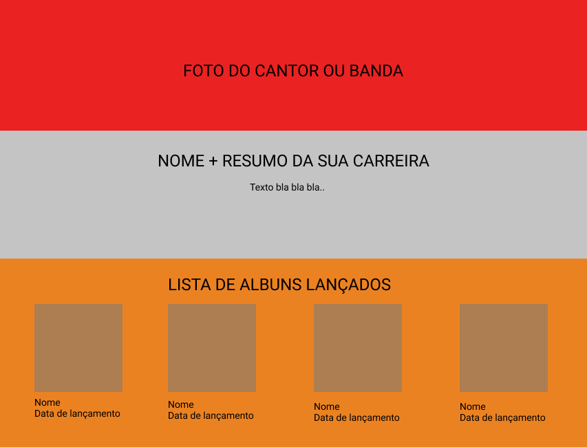

# DESAFIO HTML

## Crie um site para mostrar a sua banda preferida

o site deve ter o seguinte layout

1. Desenvolva primeiro o HTML com todas as informações
2. Adicione as imagens do cantor e álbuns
3. Troque e ajuste o tamanho das fontes do nome + resumo + nome dos alguns
4. Adicione cores para as diferentes seções do site.
5. Alinhe cada parte utilizando Flexbox.

